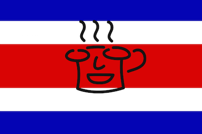

# Meetups
Presentaciones, demos y código de las charlas de [`@CocoaHeadsCR`][cocoaheads]

[cocoaheads]:https://twitter.com/cocoaheadscr

## Organización del repo
El repositorio estará organizado en carpetas por año para mantenerlo de una forma más ordenada.

Cada reunión contará con su propio archivo `.md` donde se colocarán los expositores así como links a las presentaciones y códigos demo si así lo requirieran.
Dependiendo de las presentaciones pueda que el código demo sea subido directamente a éste mismo repositorio para lo cual se generará una carpeta con la fecha del meetup en lugar de un sólo archivo `.md` y dentro de dicha carpeta se creará su propio `.md` para detallar los presentadores de dicha reunión.

# Meetups
- [Martes 21, Abril, 2015](2015/2015-04-21.md)
